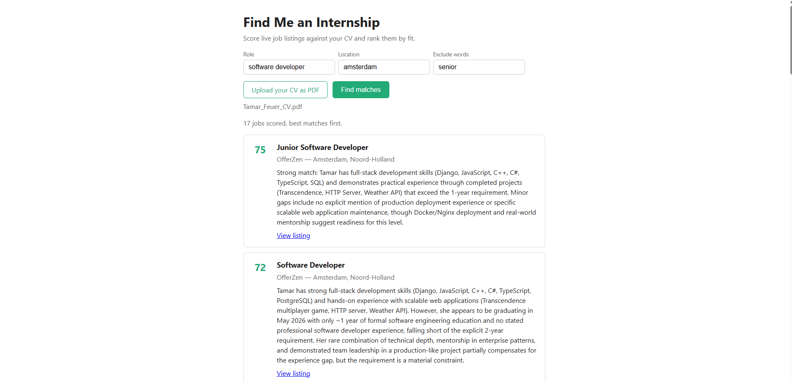

# find-me-an-internship

## What is this project?

An AI-powered internship matcher. You upload your CV as a PDF, the app fetches
live job listings, scores each one against your CV using a large language model,
and shows them ranked from best match to worst, each with a short explanation
of *why* it fits (or doesn't).



How it works, end to end:

1. You upload your CV (PDF) and optionally set the role, location, and words to exclude.
2. The backend extracts the text from the PDF.
3. It fetches matching job listings from the **Adzuna** API.
4. It sends your CV plus each listing to the **Claude** API, which returns a 0-100
   fit score and a one-line explanation per job.
5. The scored jobs are ranked best-first and shown as cards in the browser.

## Company directory

Adzuna mostly surfaces recruitment agencies, so the app has a second tab,
**Company list**: a directory of companies known to hire interns, loaded from
a CSV you provide. Each company is ranked by how many interns it has hosted, and
lists past interns as referral contacts (handles you can reach out to for a warm
intro).

This is handy when your school publishes a list of where its students have
interned. Codam, for example, provides such a list to its students, which drops
straight in (see the setup step below).

### Checking who is currently hiring

The directory tells you which companies take interns and who to ask, but not
whether they have an opening right now (there is no clean API for that). The
simplest approach is to take a shortlist from the directory and ask Claude
(claude.ai, with web search) to check their career pages, for example:

> Check which of these companies are currently hiring software interns in the Netherlands. Look at their career pages.

Give it a shortlist (say 10-20 companies) rather than the whole list, so it can
check each one properly.

## Tech stack

| Part | Technology |
|------|------------|
| Job listings | [Adzuna API](https://developer.adzuna.com) |
| CV scoring | [Anthropic Claude API](https://platform.claude.com) |
| Backend | Python + [FastAPI](https://fastapi.tiangolo.com) (also serves the frontend) |
| Frontend | Vanilla **TypeScript** (compiled with `tsc`), HTML, CSS |
| PDF text extraction | [pypdf](https://pypdf.readthedocs.io) |

The frontend is plain TypeScript (no framework) and is served as static files by
FastAPI, so the whole app runs from a single server with no CORS setup.

```
find-me-an-internship/
├── backend/          # FastAPI app + scoring/fetching logic
│   └── app/
├── frontend/         # vanilla TypeScript UI (compiled to dist/app.js)
└── README.md
```

## Getting started

### Prerequisites

- **Python 3.10+**
- **Node.js** (only to build the TypeScript frontend)
- An **Adzuna** API key (free, from [developer.adzuna.com](https://developer.adzuna.com))
- An **Anthropic** API key ([platform.claude.com](https://platform.claude.com))

### 1. Configure environment variables

```bash
cd backend
cp .env.example .env
```

Then open `.env` and fill in your keys:

```
ADZUNA_APP_ID=your_adzuna_app_id
ADZUNA_APP_KEY=your_adzuna_app_key
ANTHROPIC_API_KEY=your_anthropic_api_key
ANTHROPIC_MODEL=claude-haiku-4-5
```

`.env` is gitignored, so your keys are never committed.

### 2. Install backend dependencies

```bash
cd backend
pip install -r requirements.txt
```

### 3. Build the frontend

```bash
cd frontend
npm install
npm run build      # compiles src/app.ts to dist/app.js
```

### 4. (Optional) Add the company-directory data

The **Company list** tab reads `backend/data/intern_companies.csv`, which is
gitignored because it holds real referral handles (personal data). Copy the
example to start, or drop in your own export:

```bash
cp backend/data/intern_companies.example.csv backend/data/intern_companies.csv
```

The CSV needs `company_name`, a referral column (named `referral` or `intraID`),
`start_at`, and `end_at`. A Codam internship export works as-is.

### 5. Run the app

```bash
cd backend
uvicorn app.main:app --reload
```

Then open **http://localhost:8000** in your browser, upload a PDF CV, and click
**Find matches**.

## Notes

- Scoring calls the Claude API once per job, so each search costs a few cents
  (with the default Haiku model). To switch to a sharper, pricier model, edit
  `ANTHROPIC_MODEL` in `.env` (a commented Sonnet line is included) and restart the server.
- The interactive API docs are available at **http://localhost:8000/docs**.
